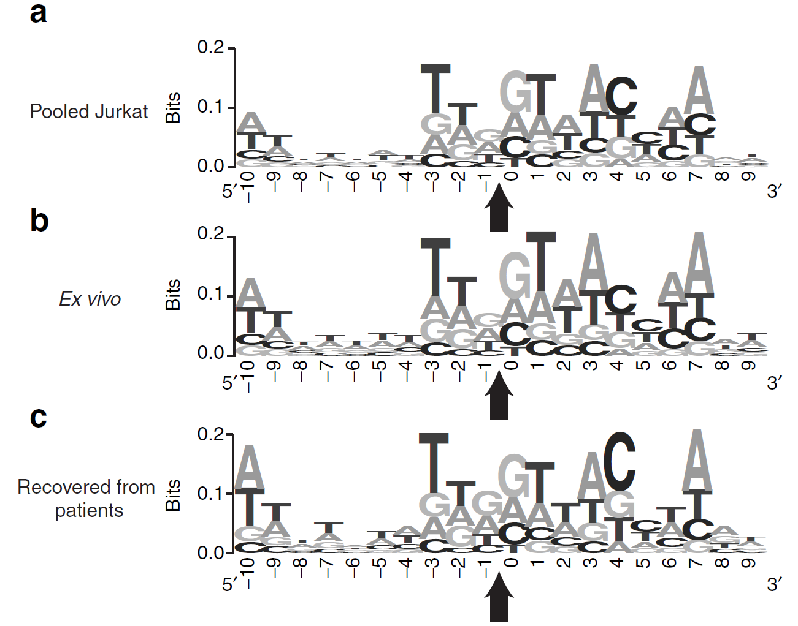

```{css STYLING, echo=FALSE}
body {font-size: 16px; background-color: #EEE;}
h1 {color: #BF1E2D !important;}
h3 {font-size: 120%; color: white; padding: 20px 20px 10px 20px; margin: -20px -30px 10px -30px; background-color: #5062AF;}
h5 {font-size: 150% !important; color: white !important; background-color: #BF1E2D !important; padding: 10px 50px; margin-top:10px;}
h6 {margin: 0 50px -24px 10px !important; font-size: 16px; font-style: italic; color: #6D4685;}
img {margin: 20px;}
li {padding-left: 50px;}
li[role=presentation] {padding-left: 10px; margin-bottom: 10px;}
.nav-pills>li>a {background-color: #DDD;}
caption {color: #5062AF; font-style: italic; font-weight: bold;}
.caption {color: #5062AF; font-style: italic; font-weight: bold; margin:20px 0 0 50px;}
div.main-container {max-width: 1800px !important;}
.title {text-align: center; color: #5062AF; font-size: 26px !important;}
.tabset {
  background-color: white;
  margin: 20px 20px;
  padding: 5px 25px;
  border: 2px solid #5062AF;
  border-radius: 10px;
  overflow:hidden;
}
.sourceCode {margin-top: 0 !important;}
.wrap {display: flex; flex-wrap: wrap;}
```

```{r setup, include = FALSE}
knitr::opts_chunk$set(eval = T, warning = F, message = F)
library(pander)
author <- stringr::str_to_title(gsub("\\.", " ", paste0(Sys.getenv("USER"), Sys.getenv("USERNAME"))))
Sdrive <- ifelse(Sys.info()[["sysname"]] == "Linux", path.expand("~/s-drive"), "S:/")
fileMeta <- data.frame(
  `Data type`=character(), `File name` = character(), `Last modified`=character(),
  `md5 sum` = character(), check.names = F, stringsAsFactors = F)
add2meta <- function(fileMeta, fname, description) {
	fileMeta[nrow(fileMeta)+1, ] <- c(
		description, paste0("[",basename(fname),"](",fname,")"),
		strftime(file.mtime(fname), "%Y-%m-%d %H:%M:%S"), as.character(tools::md5sum(fname))
    )
	return(fileMeta)
}
source("../config/variables.R")
```

::: {.tabset}
**Author:       ** `r paste0('<a href=\'mailto:', Sys.getenv("USER"), Sys.getenv("USERNAME"), '@adaptimmune.com?subject=', params$projectID, '\'>', author, '</a>')`  
**Requested by: ** `r params$requestedBy`  
**Objectives:   ** `r params$objective`  
**Date:         ** `r Sys.Date()`
:::

### Background information {.tabset}

From Jean-Marc's e-mail: *"This is part of the pre-clinical safety package. We test drug products and post-infusion samples (collected 1 year post infusion or beyond) from the same patients to assess the repertoire of LV vector integration sites in both. The polyclonality of the post-infusion sample shows absence of LV vector-related oncogenic transformation, whereas the data from the drug product shows the genomic tropism of the vector. Together, these data support the safety of the product in regard to genotoxicity."*.

More specifically, risk assessment by an external consultant came with the following recommendation: *"Review available data with respect to integration preference from any clinical samples that have undergone detailed analysis as part of clonality assessments and confirm that integration patterns in SPEAR T cell products show a similar preference for integration to published data, in regions of open chromatin, high GC content, and transcriptionally active genes and that integration is highly polyclonal, with no evidence for favouring integration near specific reported oncogenes of concern, such as LMO2."*

```{r, echo = F, eval = T}
fileMeta <- add2meta(fileMeta, "../../input/readMe.txt", "Column description for the processed integration data")
fileMeta <- add2meta(fileMeta, "../resource/NIHMS981956-supplement-Supplementary_Table_5.xlsx", "Gene counts from Fraietta *et al*., 2018")
fileMeta <- add2meta(fileMeta, "../results/geneData.tsv", "Gene-centric data (gene type, oncogene, TPM)")
fileMeta <- add2meta(fileMeta, "../results/integrationSiteData.tsv", "IS-centric data (20bp sequence around, overlapping genes, distance to DNAseI clusters, GC content in 1 kb bins)")
fileMeta <- add2meta(fileMeta, "../results/clonalityData.tsv", "Results: IS counts and TPM sums in 1 Mb genomic bins")

hg38_1mb <- read.table(file = "../results/clonalityData.tsv", sep = '\t', header = TRUE)
```

### Results {.tabset .tabset-fade .tabset-pills}

#### Sequence logo comparison

<div class="row">
<div class="col-sm-6">
<p class='caption'>Insertion site information content (Wang *et al*., 2009)</p>
<p>20 nucleotides around virus integration sites from Jurkat cells, vector-transduced CD4+ cell products (*Ex vivo*) and cells recovered from 3 patients at several times after infusion  ([Wang *et al*., 2009](https://www.sciencedirect.com/science/article/pii/S152500161631783X)).</p>
</img>
</div>

<div class="col-sm-6">
<p class='caption'>Insertion site information content (Adaptimmune)</p>
<p>20 nucleotides around virus integration sites from vector-transduced CD3^+^ cell products (*Ex vivo*) from 1 patient (`r patientId`).</p>
</img>
</div>
</div>

#### Gene analysis

<div class="row"><div class="col-sm-12">
<center>
</img>
</center>
<p class='caption'>Analysis of lentiviral insertion site in relation to genes</p>
<p>**Left**: genomic coordinates of genes were extracted from comprehensive gene annotation (Gencode v22). Relative proportions of unique lentiviral integration sites from patient `r patientId` were calculated for genomic areas outside of genes, as well as within protein coding and combined other genes.
<br>**Right**: per gene read counts from [Fraietta *et al*., 2018](https://pubmed.ncbi.nlm.nih.gov/29713085/) publication were normalised and converted to TPM. The genes were then grouped into lowly expressed (below 1 TPM), medium (1-10 TPM) and highly expressed (over 10 TPM). The list of oncogenes was extracted from [OncoPlex panel](https://testguide.labmed.uw.edu/public/view/OPX), with addition of *LMO2* gene based on [Themis *et al*., 2006](https://pubmed.ncbi.nlm.nih.gov/16084128/) paper. Integration site counts per gene were normalised for gene size. *P* values were calculated using one-tailed Kolmogorov–Smirnov test, with alternative hypothesis that there are more integration sites in oncogenes than in other genes.</p>
</div></div>


#### Open chromatin

<div class="row"><div class="col-sm-3">
<center>
</img>
</center>
</div><div class="col-sm-9">
<p class='caption'>Analysis of lentiviral insertion site in relation to open chromatin</p>
<p>DNAse I hypersensitive site clusters combined from 95 cell types were obtained from [Ensembl](http://genomebrowsermirror.riken.jp/cgi-bin/hgTrackUi?hgsid=756791099_1Yc5rdBDHaliIivzkMhzHnePO5Y0&g=wgEncodeRegDnaseClustered&hgTracksConfigPage=configure) (DNase Clusters track). Unique integration sites from patient `r patientId` were grouped according to their genomic position relative to the DNAse I hypersensitive regions: **DNAseI HS** group is sites that reside within the hypersensitive clusters. Sites that reside outside the clusters were grouped into closely proximal (**Within 1kb**) and more distant ones (**Further than 1kb**).</p>
</div></div>

#### GC content

<div class="row"><div class="col-sm-5">
<center>
</img>
</center>
</div><div class="col-sm-7">
<p class='caption'>Analysis of lentiviral insertion sites in relation to GC content</p>
<p>GC content was calculated in 1 kb windows around the integration sites and plotted as boxplot and density plot. **Red dashed line** denotes genome average GC content at 40.89% ([Piovesan *et al*., 2019](https://pubmed.ncbi.nlm.nih.gov/30813969/)).</p>
</div></div>

#### Clonality

<div class="row"><div class="col-sm-7">
<center>
</img>
</center>
</div><div class="col-sm-5">
<p class='caption'>Analysis of lentiviral insertion sites clonality in 1 Mb regions</p>
<p>Unique integration sites from transduced cell products for patient `r patientId` in 1 Mb genome regions. Combined gene expression was calculated as a sum of TPMs from genes overlapping the same 1 Mb genomic regions (gene counts from [Fraietta *et al*., 2018](https://pubmed.ncbi.nlm.nih.gov/29713085/)).</p>
</div></div>

### Conclusions {.tabset}

<li>**Sequence logo comparison**</li>
<p>Lentiviral vectors integration sites have sequence bias. Here we compared the bias to the previously published data on Jurkat cells, as well as CD4^+^ T cell therapy product before and after autologous infusions. Virtually identical sequence logos confirm that SPEAR T cell products has the same integration bias as previously reported for a therapy that is deemed safe.</p>

<li>**Gene analysis**</li>
<p>Integration site distribution confirms that vast majority (~90%) of the integration sites are located within gene bodies.
<br>Analysis of frequencies shows that lentivirus integration is biased towards genes with higher expression, consistent with the previously reported observations [Schröder *et al*., 2002](https://pubmed.ncbi.nlm.nih.gov/12202041/). Additionally, there is no bias in integration into known oncogenes, as evidenced by very high *P* values.</p>

<li>**Open chromatin**</li>
<p>DNAse I hypersensitivity is a hallmark of regulatory elements, particularly promoters. Lentiviral integration sites do not favour promoter regions (unlike other retroviruses) and distributed throughout transcription units [Papayannakos and Daniel, 2013](https://pubmed.ncbi.nlm.nih.gov/23171920/).</p>

<li>**GC content**</li>
<p>GC content is not remarkable at HIV integration sites and, when using smaller window sizes, has been shown to be below expected compared to randomly distributed in human cells ([Berry *et al*., 2017](https://pubmed.ncbi.nlm.nih.gov/28344988/)) and mouse model ([Keshet *et al*., 2011](https://pubmed.ncbi.nlm.nih.gov/21386821/), [Marshall *et al*., 2007](https://pubmed.ncbi.nlm.nih.gov/18092005/)). GC content in bigger windows is slightly higher and this is thought to be a consequence of gene-richness.</p>

<li>**Clonality**</li>
<p>Due to assay used, clonality could only be assessed using unique positions in the genome. The number of unique integration sites per 1 Mb genomic regions varies greatly (`r min(hg38_1mb$IS_count)`-`r max(hg38_1mb$IS_count)`) and directly proportional to the number and expression activity of the genes overlapping the region.</p>

### Additional info {.tabset .tabset-fade .tabset-pills}
#### Data versioning

```{r file_meta, eval=T, echo=F}
options(knitr.kable.NA = '')
kableExtra::kable_styling(knitr::kable(fileMeta, format="html", caption = "Files used for the analysis"), bootstrap_options = c("striped", "hover", "condensed", "responsive"), font_size = 14)
```

#### Notes

[The old-school integration analysis paper](https://ashpublications.org/blood/article/117/20/5332/21206/Lentiviral-vector-common-integration-sites-in) external consultant likely based their recommendation on.

[AFIS-Seq](https://academic.oup.com/nar/article/49/3/e16/6027823) (Nanopore seq-based approach) paper has some simplistic comparison plots. Access to raw data only. R code for ideogram picture creation (arrows to integration sites).

[An algorithm](https://journals.plos.org/plosone/article?id=10.1371/journal.pone.0000570) to evaluate non-randomness of integration sites. Math formulas, no code shared (would be painful to implement).

[Very relevant paper](https://www.jci.org/articles/view/130144) with raw data and **analysis scripts** + open chromatin data etc.
